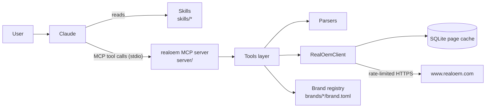

# RealOEM Searcher: Architecture Reference Document

| | |
|---|---|
| Status | Implemented (v0.1.0) |
| Last updated | 2026-09-30 |
| Companion docs | [PRD](PRD.md), [RealOEM site notes](research/realoem-site-notes.md), [implementation plans](superpowers/plans/) |

## 1. Context

RealOEM (https://www.realoem.com/bmw/enUS/) is a server-rendered parts catalog for BMW Group vehicles
behind Cloudflare, with no API. This project is a Claude plugin that answers parts questions by fetching
and parsing RealOEM pages on demand, politely and with aggressive caching. Page structure, URL patterns
and quirks are documented in the [site notes](research/realoem-site-notes.md); this document defines how
the software is built.

## 2. System overview



- **Skills** carry workflow knowledge: which tools to chain, how to explain BMW-specific concepts, what
  RealOEM cannot answer. They never touch HTML.
- **The MCP server** owns all data access: HTTP, rate limiting, caching, parsing and result shaping.
  Tools return typed, structured results.

## 3. Architecture decisions

| # | Decision | Rationale | Alternatives rejected |
|---|---|---|---|
| AD1 | Plugin bundling a local stdio **MCP server** plus **skills** | One long-lived process can enforce a single rate limit and hold cache handles; typed tools isolate fragile HTML parsing; server works in any MCP client; skills add workflow knowledge | Skills + CLI scripts (no shared rate limit, per-call process start); MCP only (no BMW workflow guidance) |
| AD2 | **Python ≥ 3.11**, packaged with **uv**, launched by `uv run --quiet --no-dev --frozen --directory ${CLAUDE_PLUGIN_ROOT}/server realoem-mcp` | Good HTML tooling; uv installs deps on first run; no PyPI release needed | C#/.NET (runtime distribution); TypeScript |
| AD3 | Official **`mcp` SDK 2.x** (`mcp.server.mcpserver.MCPServer`) | Maintained reference SDK; pydantic return types become structured output; in-memory `mcp.Client` for tests | SDK 1.x `FastMCP` (superseded); third-party `fastmcp` |
| AD4 | **httpx** (async) for HTTP, **selectolax** for HTML | Fast, small, typed; `httpx.MockTransport` makes the client testable without extra libraries | requests (sync), BeautifulSoup (slower, looser) |
| AD5 | **Cache raw pages** (not parsed results) in **SQLite**, keyed by request URL, TTL by page type | Parser fixes apply to cached data immediately; one simple table; stdlib `sqlite3`; survives restarts | Caching parsed results (stale on parser change); in-memory only; no cache |
| AD6 | **One global rate limiter**: one request in flight, ≥ `min_interval` (default 2.0 s) between request starts | Politeness required by RealOEM's content signals and load | Per-tool limits; concurrency |
| AD7 | **Pin `ro_ui=v2`**, parse only v2, never send `dmode=0`; fail with `LayoutChanged` on unexpected structure | v1/v2 differ on select/partgrp; silent partial data is worse than a clear error | Parsing both variants |
| AD8 | **Never bypass Cloudflare**; detect challenges and raise `BotChallenge` | Ethics/ToS; brittle | Headless browser, challenge solvers |
| AD9 | **Brand registry as data** in `brands/<brand>/brand.toml`, loaded at startup | Satisfies "brand-specific in its own directory"; brand quirks change without code changes | Hard-coded brand logic |
| AD10 | **Fixtures are trimmed real pages** (scripts/ads/affiliate chrome removed, VINs masked), produced by a repo script from raw captures that are never committed | Offline deterministic tests; small repo; avoids republishing full third-party pages | Committing raw pages; synthetic HTML |
| AD11 | Tools are **stateless**; multi-step flows (model cascade) pass state as parameters | Simple, cache-friendly, restart-safe | Server-side sessions |
| AD12 | Language fixed to **`enUS`** | Prices are USD everywhere anyway; one parser vocabulary | Multi-language |
| AD13 | **Honest, identifying User-Agent** `RealOEM-Searcher/<version> (+https://github.com/Cadtastic/RealOEM-Searcher)` | Verified 2026-09-30 to receive HTTP 200 (only curl's default UA is challenged). Lets RealOEM identify and, if it chooses, block us; consistent with AD8 | Spoofing a desktop browser UA (evades a bot filter, contradicts AD8) |
| AD14 | **No cookie jar**: every request sends exactly `Cookie: ro_ui=v2`; server-set cookies are discarded | Site sends `Vary: Cookie`; cached pages must not depend on hidden state (`pvin`, A/B cookies) | httpx default cookie persistence |
| AD15 | **Tool modules are auto-discovered** (`pkgutil` over `realoem_mcp.tools`); versions are bumped only at release | Feature branches add files instead of editing shared ones, so parallel branches don't conflict | Central registration list; per-PR version bumps |
| AD16 | **Vehicle index = committed per-brand CSV baseline + runtime SQLite store in the user data dir** (`vehicles.sqlite3`, separate from the page cache) | CSV diffs are reviewable and small in git; SQLite gives durable local additions and indexed search; keeping it out of the cache DB means `cache_clear`/schema resets never lose it; shipping the baseline means RealOEM serves the 165 index pages once, not once per user | Committed `.sqlite` (binary, bloats history); JSON (larger, not one-row-per-line); local-only build (165 requests per user); table inside the cache DB |

## 4. Repository layout

```
RealOEM-Searcher/
├─ .claude-plugin/
│  ├─ plugin.json               # manifest; MCP server "realoem"; skills from the default skills/
│  └─ marketplace.json          # single-plugin marketplace (source "./")
├─ .github/workflows/ci.yml     # ruff + pytest (offline)
├─ brands/
│  ├─ bmw/          brand.toml, README.md, vehicles.csv
│  ├─ mini/         brand.toml, README.md, vehicles.csv
│  ├─ rolls-royce/  brand.toml, README.md, vehicles.csv
│  └─ motorrad/     brand.toml, README.md, vehicles.csv   # (+ skills/ when a brand-specific skill is needed)
├─ skills/
│  ├─ part-lookup/SKILL.md       # feature A
│  ├─ vin-decode/SKILL.md        # feature B
│  ├─ diagram-browse/SKILL.md    # feature C
│  ├─ fitment/SKILL.md           # feature D
│  ├─ supersession/SKILL.md      # feature E
│  └─ vehicle-index/SKILL.md     # F6
├─ server/
│  ├─ pyproject.toml            # project "realoem-mcp", script realoem-mcp = realoem_mcp.server:main
│  ├─ uv.lock
│  ├─ scripts/
│  │  ├─ trim_fixture.py        # raw page → trimmed fixture
│  │  ├─ capture_page.py        # polite single-page capture through RealOemClient (raw, uncommitted)
│  │  └─ rebuild_vehicle_index.py  # maintainer-only full rebuild of brands/*/vehicles.csv (F6)
│  ├─ src/realoem_mcp/
│  │  ├─ __init__.py            # __version__
│  │  ├─ server.py              # build_server(services) -> MCPServer; main()
│  │  ├─ services.py            # Services container + create_services(settings)
│  │  ├─ config.py              # Settings (env-overridable)
│  │  ├─ errors.py              # RealOemError hierarchy
│  │  ├─ page_types.py          # PageType enum + TTLs
│  │  ├─ http_client.py         # RealOemClient, Page
│  │  ├─ cache.py               # PageCache (SQLite)
│  │  ├─ brands.py              # Brand, BrandRegistry
│  │  ├─ vehicle_ids.py         # VehicleId parse/normalize
│  │  ├─ vehicle_index.py       # VehicleIndex: CSV baseline → vehicles.sqlite3, search, add (F6)
│  │  ├─ models/                # pydantic models: parser outputs and tool results
│  │  │  ├─ common.py           # ResultMeta, VehicleRef, DiagramRef           (foundation)
│  │  │  ├─ parts.py            # SupersessionEntry, SeriesUse, ModelUse, PartXref, PartLookupResult (A)
│  │  │  ├─ select.py           # SelectOption, SelectLevel, SelectPage        (B)
│  │  │  ├─ vin.py              # ProductionStats, VinDecodeResult             (B)
│  │  │  ├─ catalog.py          # VehicleSpecs, MainGroup, Subgroup, DiagramThumb, Hotspot,
│  │  │  │                      #   OptionCode, Condition, PartRow, *Result    (C)
│  │  │  ├─ fitment.py          # PartSearchHit, PartSearch, FitmentResult, CompareScope, PartComparison,
│  │  │  │                      #   PartSummary, ComparisonResult                (D)
│  │  │  ├─ supersession.py     # SupersessionHop, SupersessionResult          (E)
│  │  │  └─ vehicles.py         # IndexedVehicle, IndexMeta, VehicleSearchResult, VehicleIndexUpdateResult,
│  │  │                         #   VehicleIndexPage                          (F6)
│  │  ├─ parsers/
│  │  │  ├─ common.py           # selectolax helpers, dates, prices, canonical, JSON-LD (foundation)
│  │  │  ├─ part_numbers.py     # (A) normalize/verify
│  │  │  ├─ supersession.py     # (A) superseded-by / supersedes blocks; reused by D, E
│  │  │  ├─ partxref.py         # (A)
│  │  │  ├─ select.py           # (B) full cascade page incl. options; reused by C
│  │  │  ├─ production.py       # (B)
│  │  │  ├─ partgrp.py          # (C) main groups + diagram list
│  │  │  ├─ showparts.py        # (C)
│  │  │  ├─ partsearch.py       # (D)
│  │  │  └─ vehicles.py         # (F6) vehicles index page; is_past_end() spots a page past the end
│  │  └─ tools/                 # auto-discovered; each module defines register(app, services)
│  │     ├─ admin.py            # server_status, cache_clear                   (foundation)
│  │     ├─ parts.py            # lookup_part + fetch_part_xref()              (A)
│  │     ├─ vin.py              # decode_vin                                   (B)
│  │     ├─ catalog.py          # select_vehicle, list_part_groups, list_diagrams, get_diagram_parts
│  │     │                      #   + fetch_diagram_list(), fetch_diagram_parts() (C)
│  │     ├─ fitment.py          # check_fitment, compare_vehicles              (D)
│  │     ├─ vehicles.py         # find_vehicle, update_vehicle_index           (F6)
│  │     └─ supersession.py     # trace_supersession                           (E)
│  └─ tests/
│     ├─ conftest.py            # fixture loader, fake transport, services factory
│     ├─ fixtures/<page-type>/*.html
│     ├─ unit/…                 # parsers, client, cache, brands
│     ├─ tools/…                # tools via in-memory mcp.Client
│     └─ live/…                 # @pytest.mark.live, skipped unless REALOEM_LIVE=1
└─ docs/
   ├─ PRD.md, ARD.md
   ├─ research/realoem-site-notes.md
   └─ superpowers/plans/*.md
```

`.research-raw/` (git-ignored) holds full captured pages locally; fixtures are derived from it.

## 5. Components

### 5.1 Plugin manifest

`.claude-plugin/plugin.json`:

```json
{
  "name": "realoem-searcher",
  "displayName": "RealOEM Searcher",
  "version": "0.1.0",
  "description": "Look up BMW, MINI, Rolls-Royce and BMW Motorrad parts on RealOEM.com: part numbers and supersession chains, VIN decoding, parts diagrams, fitment checks, vehicle comparison and a local vehicle finder.",
  "author": { "name": "Cadtastic" },
  "homepage": "https://github.com/Cadtastic/RealOEM-Searcher",
  "repository": "https://github.com/Cadtastic/RealOEM-Searcher",
  "license": "MIT",
  "keywords": ["bmw", "mini", "rolls-royce", "motorrad", "realoem", "oem-parts", "part-numbers", "vin-decoder", "parts-diagrams", "mcp"],
  "mcpServers": {
    "realoem": {
      "command": "uv",
      "args": ["run", "--quiet", "--no-dev", "--frozen", "--directory", "${CLAUDE_PLUGIN_ROOT}/server", "realoem-mcp"],
      "env": { "REALOEM_BRANDS_DIR": "${CLAUDE_PLUGIN_ROOT}/brands" }
    }
  }
}
```

- Skills load from the default `skills/` folder. If a brand-specific skill is ever needed, add
  `"skills": ["./skills", "./brands/<brand>/skills"]` (the field supplements the default folder) in that
  change; do not list folders that don't exist.
- `--no-dev` keeps test/lint tools out of users' plugin environments; `--frozen` runs from the
  committed `uv.lock` without re-locking in the plugin cache.
- Tools are exposed to Claude as `mcp__plugin_realoem-searcher_realoem__<tool>`; skills refer to them by
  short name (`lookup_part`).
- `marketplace.json`: `{"name": "realoem-searcher", "owner": {"name": "Cadtastic"}, "plugins": [{"name":
  "realoem-searcher", "source": "./", ...}]}`. `Cadtastic/Claude-Plugin-Collection` (marketplace
  `cadtastic`) lists it with `"source": {"source": "url", "url":
  "https://github.com/Cadtastic/RealOEM-Searcher.git", "ref": "v<version>"}` (release step, outside the
  feature branches). Not the `github` source form: Claude Code clones that over SSH, which fails for
  users without a GitHub SSH key.
- Validate locally before each PR with `claude plugin validate . --strict` (the marketplace) and
  `claude plugin validate .claude-plugin/plugin.json --strict` (the plugin manifest).

### 5.2 Settings (`config.py`)

`Settings` (frozen dataclass), each field overridable by environment variable:

| Field | Env | Default |
|---|---|---|
| `base_url` | `REALOEM_BASE_URL` | `https://www.realoem.com` |
| `lang` | — | `enUS` |
| `min_interval_s` | `REALOEM_MIN_INTERVAL` | `2.0` (values < 1.0 are clamped to 1.0) |
| `timeout_s` | `REALOEM_TIMEOUT` | `20.0` |
| `cache_dir` | `REALOEM_CACHE_DIR` | `platformdirs.user_cache_dir("realoem-searcher")` |
| `data_dir` | `REALOEM_DATA_DIR` | `platformdirs.user_data_dir("realoem-searcher")` (durable data: vehicle index store) |
| `brands_dir` | `REALOEM_BRANDS_DIR` | `<repo>/brands` resolved relative to the package |
| `user_agent` | — (not overridable) | `RealOEM-Searcher/<__version__> (+https://github.com/Cadtastic/RealOEM-Searcher)` (AD13) |

### 5.2a Services container (`services.py`)

```python
@dataclass
class Services:
    settings: Settings
    cache: PageCache
    client: RealOemClient
    brands: BrandRegistry
    extras: dict[str, Any] = field(default_factory=dict)   # branch-owned singletons (e.g. vehicle index)

    async def aclose(self) -> None: ...          # closes client (httpx), cache (sqlite), and any extra with close()

def create_services(settings: Settings, *, transport: httpx.AsyncBaseTransport | None = None,
                    clock: Callable[[], float] | None = None,
                    sleep: Callable[[float], Awaitable[None]] | None = None) -> Services: ...
```

Tools and exported fetch helpers receive a `Services` and use only these five attributes; `extras` holds
branch-owned singletons such as the vehicle index (`tools/vehicles.py`).

### 5.3 Errors (`errors.py`)

```
RealOemError(Exception)            # base; .message is user-facing
├─ InvalidInput                    # rejected before any request
├─ NotFound                        # RealOEM has no such part/vehicle/VIN
├─ BotChallenge                    # Cloudflare challenge; includes the URL to open in a browser
├─ LayoutChanged(page_type, detail, url)   # parser invariant failed
└─ UpstreamError(status, url, detail=None) # non-200 after retries, timeouts, network errors
```

Tools catch `RealOemError` and raise `mcp.server.mcpserver.exceptions.ToolError(err.message)`, which
the SDK returns as an `is_error` result. `NotFound` is **not** used for normal "no results" answers that
have a status field (e.g. `lookup_part` returns `status="not_found"`); it is for missing inputs such as an
invalid vehicle id.

### 5.4 Page types and TTLs (`page_types.py`)

| PageType | Path | TTL |
|---|---|---|
| `SELECT` | `select` (cascade and VIN) | 30 days (VIN hits: 180 days; VIN misses: 1 day; chosen by caller via `ttl`) |
| `PRODUCTION` | `production` | 180 days (misses shortened to 1 day) |
| `PARTGRP` | `partgrp` (main groups and `&mg=` diagram lists) | 30 days (an unknown main group is shortened to 1 day) |
| `SHOWPARTS` | `showparts` | 30 days |
| `PARTXREF` | `partxref` | 7 days |
| `PARTSEARCH` | `partsearch` | 7 days |
| `PART` | `part` | 7 days |
| `VEHICLES` | `vehicles` (vehicles index) | 1 day (`update_vehicle_index` always fetches with `refresh=True`; a past-the-end probe is expired immediately) |

PageType **values are the path strings** (`"select"`, `"production"`, `"partgrp"`, `"showparts"`,
`"partxref"`, `"partsearch"`, `"part"`, `"vehicles"`); `cache_clear(page_type=...)` accepts these values.
`client.fetch(..., ttl=...)` may override the default. The TTL is applied when a page is **written**
(stored as `expires_at`). A tool that parses a negative result (e.g. VIN miss) calls
`cache.shorten(url, ttl)` to cap that entry's lifetime.

### 5.5 HTTP client (`http_client.py`)

```python
@dataclass(frozen=True)
class Page:
    page_type: PageType
    url: str            # canonical request URL (cache key)
    final_url: str      # after redirects
    status: int
    html: str
    fetched_at: datetime  # UTC
    from_cache: bool

class RealOemClient:
    def __init__(self, settings, cache: PageCache, *, transport: httpx.AsyncBaseTransport | None = None,
                 clock: Callable[[], float] = time.monotonic,
                 sleep: Callable[[float], Awaitable[None]] = asyncio.sleep): ...
    def build_url(self, path: str, params: Mapping[str, str]) -> str: ...
    async def fetch(self, page_type: PageType, path: str, params: Mapping[str, str], *,
                    refresh: bool = False, ttl: timedelta | None = None) -> Page: ...
    def cached(self, page_type: PageType, path: str, params: Mapping[str, str]) -> Page | None: ...
        # cache-only lookup: unexpired hit or None; never touches the network
    async def aclose(self) -> None: ...
    requests_made: int   # process-wide network request counter (server_status only)
```

Behavior:

1. `build_url` → `{base_url}/bmw/{lang}/{path}?{params}` with params **in the order given**, encoded with
   `urllib.parse.urlencode(..., quote_via=quote)` (spaces → `%20`, commas encoded). Each tool builds its
   params in the fixed order documented in §5.11, so a page always has one cache key.
2. Unless `refresh`, return an unexpired cache hit (`from_cache=True`) **without taking the lock**.
3. Acquire the global `asyncio.Lock`; **re-check the cache** (another call may have just fetched it);
   wait until `min_interval_s` has passed since the previous request start (injected `clock`/`sleep`);
   send GET with headers `User-Agent` (AD13), `Accept: text/html`, `Accept-Language: en-US` and exactly
   `Cookie: ro_ui=v2` (AD14; the `httpx.AsyncClient` is created without persisting cookies, and
   server-set cookies are ignored); follow redirects **only within the base URL's host** (a redirect to
   any other host → `UpstreamError`).
4. Challenge detection: status 403/503 with header `cf-mitigated: challenge`, or `<title>Just a
   moment...</title>` in the body → `BotChallenge`. Never retried.
5. 429 / 5xx / timeout → retry up to 2 times, waiting `Retry-After` (capped at 30 s) or 5 s then 15 s;
   still failing → `UpstreamError`.
6. If response header `X-RO-UI` is present and does not start with `v2` → `LayoutChanged`.
7. Only HTTP 200 pages are cached. The redirect-to-landing case (final URL path `/bmw/` or `/bmw/enUS/`
   without the requested path) is returned uncached with `final_url` set; callers turn it into
   `NotFound`. Helper: `page.redirected_away` (final path does not end with the requested path).
8. Two different counts: the client's process-wide `requests_made` (shown by `server_status`) counts
   **every HTTP request actually sent**, including retries, redirect hops, challenges and failures.
   A tool call's `ResultMeta.requests_made` counts **pages** it used with `from_cache=False` (a page that
   needed retries or a redirect still counts once); tools compute it from their pages, never from the
   global counter.

### 5.6 Cache (`cache.py`)

SQLite database `pages.sqlite3` in `cache_dir`, WAL mode:

```sql
CREATE TABLE IF NOT EXISTS pages (
  url TEXT PRIMARY KEY, page_type TEXT NOT NULL, final_url TEXT NOT NULL, status INTEGER NOT NULL,
  html TEXT NOT NULL, fetched_at TEXT NOT NULL, expires_at TEXT NOT NULL);
CREATE TABLE IF NOT EXISTS meta (key TEXT PRIMARY KEY, value TEXT NOT NULL);  -- schema_version
```

API: `get(url) -> Page | None` (unexpired only), `put(page, ttl)`, `shorten(url, ttl)` (sets
`expires_at = min(expires_at, fetched_at + ttl)`), `clear(page_type: PageType | None = None) -> int`,
`stats() -> CacheStats(entries, bytes, path)`. Synchronous `sqlite3` calls (sub-millisecond at this
volume; a single connection with `check_same_thread=False`, used only from the event loop thread). A
schema-version mismatch drops and recreates the tables. Timestamps are stored as UTC ISO-8601 strings.

### 5.7 Brand registry (`brands.py`, `brands/*/brand.toml`)

```toml
# brands/mini/brand.toml
id = "mini"
display_name = "MINI"
product = "P"                         # P = cars, M = motorcycles
id_brand_segments = ["Mini"]          # vehicle-id brand segment(s)
series_patterns = ['^R5\d$', '^R6\d$', '^F5[4-7]$', '^F60$', '^J0\d$', '^U25$']
label_keywords = ["MINI"]             # used when classifying partxref series labels
wmi = ["WMW", "WMZ"]
notes = "Classic catalog (archive=1) holds R50/R52/R53."
dedupe_repeated_names = false         # motorrad: true ("Engine Engine" → "Engine")
priority = 10                         # lower = checked first when matching series patterns
```

- `Brand` fields: all keys above (`dedupe_repeated_names` defaults to `false`, list fields default to
  empty); any other keys are kept in `Brand.extra: dict` so later branches can add data without editing
  `brands.py`.
- Foundation ships all four `brand.toml` files:

  | id | product | id_brand_segments | series_patterns | label_keywords | wmi | priority |
  |---|---|---|---|---|---|---|
  | `mini` | P | `Mini` | `^R5\d$`, `^R6\d$`, `^F5[4-7]$`, `^F60$`, `^J0\d$`, `^U25$` | `MINI` | `WMW`, `WMZ` | 10 |
  | `rolls-royce` | P | `Rolls_Royce` | `^RR\d+N?$`, `^R[12]\dN$` | `Rolls-Royce`, `Phantom`, `Ghost`, `Wraith`, `Dawn`, `Cullinan`, `Spectre` | `SCA` | 20 |
  | `motorrad` | M | `BMW` | `^K`, `^R\d`, `^T\d` | — | `WB1`, `WB3` | 30 |
  | `bmw` | P | `BMW`, `Zinoro` | — (fallback) | — | `WBA`, `WBS`, `WBY`, `WBX`, `5UX`, `5UM`, `5YM`, `4US`, `3MW`, `LBV` | 100 |

  `motorrad` sets `dedupe_repeated_names = true`. WMI lists are best-effort (verified in the B plan).
- `BrandRegistry.load(dir)` reads all `brand.toml` files; `brand_segments()` returns every
  `id_brand_segments` value (used by `VehicleId.parse`).
- Resolution rules (candidates are always tried in ascending `priority`):
  - `for_series(code, *, label=None, product=None)`: if `product` is given, only brands with that product
    are candidates; first match on `label_keywords` (case-sensitive substring of `label`), then on
    `series_patterns`; otherwise the product fallback (`bmw` for `P` or unknown, `motorrad` for `M`).
  - `for_vehicle_id(vid, *, product=None)`: candidates = brands whose `id_brand_segments` contain
    `vid.brand_segment`; one → return it; several (e.g. `BMW` → bmw + motorrad) → `for_series(vid.series,
    product=product)` restricted to those candidates, falling back to the lowest-priority candidate
    (`bmw`); none → `for_series(vid.series, product=product)`.
  - `for_wmi(prefix)`: brand whose `wmi` list contains the 3-char prefix, else `None`.
- Known edge: without a label keyword or `product`, a motorcycle series code shaped like `R5x`/`R6x`
  would match MINI first. Callers pass `product` whenever the page tells them (select/partgrp pages,
  vehicle ids with a `Mini` segment); partxref labels include "MINI" for MINI series, so A relies on
  label keywords.

### 5.8 Vehicle ids (`vehicle_ids.py`)

`VehicleId.parse(raw, *, brand_segments=DEFAULT_BRAND_SEGMENTS) -> VehicleId(raw, type_code, market,
month, year, series, brand_segment, model)` handles the `-` form (`VB13-USA-10-2005-E90-BMW-325i`), the
xref `_` form (`VB13-USA-02_2004_E90_BMW_325i`) and the empty-date form (`VB13-USA---E90-BMW-325i`).
Brand segments can contain the separator (`Rolls_Royce`), so after the series token the parser matches
the **longest known brand segment** (`DEFAULT_BRAND_SEGMENTS = ("Rolls_Royce", "Zinoro", "Mini", "BMW")`; callers
with a registry pass `registry.brand_segments()`); the remainder is the model. Unknown shapes keep `raw`
and parse only `type_code` and `market`. Input is percent-decoded once (ids copied from
encoded links) and trimmed; `str(vid)` returns that decoded `raw`, which the client encodes when sending.
`production_month` property returns `"YYYY-MM"` or `None`.

Note for skills: ids taken from `partxref` model rows carry a nominal date (the vehicle's
production-start month) in the `_` form, which RealOEM treats as undated (`VB13-USA---…`), so their
parts lists are not narrowed to a build month; `find_vehicle` ids carry the production-start month.
For a specific car, use an id from `decode_vin` or `select_vehicle`.

### 5.9 Parsers

- Pure functions `parse_<page>(html: str, *, url: str, ...) -> <pydantic model>`; no I/O. Parsers may
  take extra keyword-only collaborators they need for shaping results without I/O (e.g.
  `parse_partxref(html, *, url, brands, client)` uses the brand registry and `client.build_url`). Fragment parsers
  shared between pages take a parsed tree plus `url` (e.g. `parse_supersession(tree, *, url)`) and
  return empty results when their block is absent.
- Built on `parsers/common.py`: `tree(html)`, `text(node)` (whitespace-collapsed), `require(tree,
  selector, page_type, url)` (raises `LayoutChanged`), `parse_mdy`, `parse_my`, `parse_yyyymm00`,
  `parse_price_usd`, `canonical_url(tree)`, `json_ld(tree, type_)`.
- Scope selectors to data containers (see site notes §1.5). Every parser has at least one fixture test
  per brand/edge case listed in its plan and one test proving `LayoutChanged` on a structurally broken
  page.

### 5.10 Tools and results

- Each `tools/<module>.py` exposes `register(app: MCPServer, services: Services) -> None`.
  `build_server` discovers modules with `pkgutil.iter_modules(realoem_mcp.tools.__path__)` and calls
  every `register` it finds (AD15), so feature branches add a module without editing `server.py`.
- Tool functions are `async`, have docstrings written for the model (when to use, inputs, what comes
  back), catch `RealOemError` → `ToolError`, and return pydantic models.
- **Never keep an unparseable page cached:** pages are cached by the client before parsing, so when a
  parser raises `LayoutChanged` for a fetched page, the calling tool/helper runs
  `services.cache.shorten(page.url, timedelta(0))` (expires it immediately) before re-raising. Each
  feature tests this (serve a broken page twice → two requests).
- Every **data** tool result extends `ResultMeta` (admin tools `server_status` and `cache_clear`, and the
  local-only `find_vehicle`, whose result has no `ResultMeta`, are exempt):

```python
class ResultMeta(BaseModel):
    source_urls: list[str]
    fetched_at: datetime        # oldest fetched_at among pages used (UTC)
    from_cache: bool            # True only if every page came from cache
    requests_made: int          # pages this call fetched from the network (§5.5 rule 8)

    @classmethod
    def from_pages(cls, pages: Sequence[Page], **fields) -> Self: ...   # fills the four fields
```

- Common parameter: `refresh: bool = False` on every tool that fetches, except `update_vehicle_index`
  (always fetches fresh; no `refresh` parameter). `find_vehicle` makes no requests.
- Date conventions in results: full dates `date` (ISO `YYYY-MM-DD`); month precision `str` `"YYYY-MM"`;
  prices `float | None` in USD.

Shared models (`models/common.py`, foundation):

```python
class VehicleRef(BaseModel):
    vehicle_id: str
    type_code: str
    market: str
    production_month: str | None     # "YYYY-MM"
    series: str | None
    brand: str                       # brand registry id: bmw | mini | rolls-royce | motorrad
    model: str | None

class DiagramRef(BaseModel):
    vehicle_id: str
    diag_id: str                     # "{mg}_{nnnn}"
    name: str
    url: str
```

Every branch builds these two models only through foundation helpers, so ids, model names and URLs are
consistent across tools:

- `VehicleRef.from_id(vid: VehicleId, brand: str) -> VehicleRef` — copies `vid.raw`, `type_code`,
  `market`, `production_month`, `series` and `model` (model as in the id, e.g. `Cooper_S`).
- `DiagramRef.build(client: RealOemClient, vehicle_id: str, diag_id: str, name: str) -> DiagramRef` —
  `url = client.build_url("showparts", {"id": vehicle_id, "diagId": diag_id})` (never href-joined, no
  `#fragment`).

### 5.11 Tool contracts

Parameters are listed in the order they are sent to RealOEM. All data tools also take `refresh: bool =
False`, except `update_vehicle_index` (always fresh, no `refresh` parameter) and `find_vehicle` (no
requests). Result fields exclude the `ResultMeta` fields.

**Admin (foundation, `tools/admin.py`)**

| Tool | Parameters | Result |
|---|---|---|
| `server_status` | — | `version, base_url, user_agent, min_interval_s, cache_path, cache_entries, cache_bytes, requests_made` |
| `cache_clear` | `page_type: str \| None = None` (PageType value) | `removed: int` |

**A: `lookup_part(part_number: str, series: str | None = None)` → `PartLookupResult`** (`tools/parts.py`,
`models/parts.py`). Request: `partxref` with params `q`, then `series` if given.

```python
class SupersessionEntry(BaseModel):
    part_number: str; description: str | None
    valid_from: date | None; valid_to: date | None      # valid_to None = open-ended
    remark: str | None; in_catalog: bool                # link was part?… (True) or partxref?q= (False)

class SeriesUse(BaseModel):
    code: str; name: str; brand: str
    production_from: str | None; production_to: str | None   # "YYYY-MM"

class ModelUse(BaseModel):
    vehicle: VehicleRef; body: str | None; engine: str | None; diagram: DiagramRef

class PartXref(BaseModel):                      # parser output of parsers/partxref.py
    part_number: str; description: str | None; supplier_ref: str | None; weight_kg: float | None
    valid_from: date | None; valid_to: date | None; ended: bool
    superseded_by: list[SupersessionEntry]; supersedes: list[SupersessionEntry]
    series: list[SeriesUse]; models: list[ModelUse]

class PartLookupResult(ResultMeta):
    query: str                                   # normalized input
    status: Literal["current", "ended", "not_found"]
    part: PartXref | None                        # None when not_found
```

- Input: `parsers.part_numbers.normalize(raw) -> str` strips spaces, dashes and dots and returns the
  digits if there are exactly 7 or 11 (else `InvalidInput`); `q` is sent as those digits.
  `parsers.part_numbers.matches(query, returned) -> bool` is exact for 11 digits and last-7 for 7 digits;
  `00000000000` never matches.
- `description` comes only from the xref page, in order: the `h1` "number - description" form, the ECS
  `data-ecs-part-name` attribute, a supersession link that names this part; no extra requests. It may be
  `None`.
- Exported for D and E: `async def fetch_part_xref(services, part_number: str, *, series: str | None =
  None, refresh: bool = False) -> tuple[PartXref | None, Page]` — accepts raw user input (normalizes it);
  returns `None` when RealOEM reports not found or `matches()` fails.
- Exported for D: `parsers.supersession.parse_supersession(tree, *, url) -> tuple[list[SupersessionEntry],
  list[SupersessionEntry]]` (superseded_by, supersedes; empty lists when absent).

**B: `decode_vin(vin: str, include_production: bool = False)` → `VinDecodeResult`** (`tools/vin.py`,
`models/vin.py`, `models/select.py`). VINs are normalized (uppercase, separators removed) and reduced
to the **last 7 characters before any request**, so short and full VINs share a cache entry and the full
VIN is never sent. Requests: `select` with `vin`; if `include_production`, `production` with `vin`.

```python
class SelectOption(BaseModel):  value: str; label: str; selected: bool
class SelectLevel(BaseModel):   level: str; label: str; options: list[SelectOption]
                                # level ∈ product catalog series body model market prod engine steering trans
class SelectPage(BaseModel):    levels: list[SelectLevel]; vehicle_id: str | None
                                type_code: str | None; summary: str | None      # parser output (B), reused by C

class ProductionStats(BaseModel):
    built_month: str; seq_in_month: int | None; total_in_month: int | None
    seq_in_type: int | None; total_in_type: int | None

class VinDecodeResult(ResultMeta):
    serial: str; status: Literal["found", "not_found"]
    confidence: Literal["normal", "low"]; warnings: list[str]
    vehicle: VehicleRef | None
    product: Literal["car", "motorcycle"] | None; catalog: Literal["current", "classic"] | None
    series_name: str | None; body: str | None; engine: str | None
    steering: str | None; transmission: str | None
    production: ProductionStats | None
```

VIN hits are cached 180 days; misses (select and production) are shortened to 1 day (§5.4). For a
17-character VIN, `for_wmi(vin[:3])` is compared with the decoded brand: mismatch → `confidence="low"`
plus a warning; unknown prefix (`None`) → `confidence="normal"` plus a warning "unrecognized
manufacturer prefix". 7-character input → `confidence="normal"`, no WMI warning.

**C: catalog tools** (`tools/catalog.py`, `models/catalog.py`), one request each.

| Tool | Parameters (send order) | Result |
|---|---|---|
| `select_vehicle` | `product: "P"\|"M" = "P"`, `archive: "0"\|"1" \| None`, `series`, `body`, `model`, `market`, `prod` (`YYYYMM00`), `engine`, `steering`, `trans` (all `str \| None = None`; only non-None sent) | `VehicleSelectionResult(ResultMeta)`: `selected: dict[str, SelectOption]` (effective, incl. auto-selected), `next_level: str \| None`, `options: list[SelectOption]` (for `next_level`), `complete: bool`, `vehicle: VehicleRef \| None`, `type_code: str \| None`, `summary: str \| None` |
| `list_part_groups` | `vehicle_id: str` | `PartGroupsResult`: `specs: VehicleSpecs` (`vehicle: VehicleRef` with canonical id, `model_name, body, engine, steering, transmission`), `main_groups: list[MainGroup(mg: str, name: str)]` |
| `list_diagrams` | `vehicle_id: str`, `main_group: str` | `DiagramListResult`: `vehicle_id`, `main_group`, `subgroups: list[Subgroup(code, name, diagrams: list[DiagramThumb(diagram: DiagramRef, thumbnail_url)])]` |
| `get_diagram_parts` | `vehicle_id: str`, `diag_id: str` | `DiagramPartsResult`: `diagram: DiagramRef`, `image_url`, `image_width`, `image_height` (from the `img` width/height attributes, e.g. 640×448), `hotspots: list[Hotspot(position, x1, y1, x2, y2)]` in **that same display space** (raw `partsimgmap` values, no scaling), `rows: list[PartRow]`, `notes_legend: dict[str, str]` |

```python
class OptionCode(BaseModel): code: str; value: str             # "S205A", "Yes"
class Condition(BaseModel):  text: str; option_codes: list[OptionCode]
class PartRow(BaseModel):
    position: str; description: str; supplement: str | None; qty: str | None
    valid_from: str | None; valid_to: str | None                # "YYYY-MM"
    part_number: str | None; price_usd: float | None; notes: str | None
    has_photo: bool; indent: int; conditions: list[Condition]
```

- Invalid vehicle id (redirect to `/bmw/`) → `NotFound`. A main group with no diagrams on the page →
  `NotFound("vehicle <id> has no main group <mg>")`. A diagId from another vehicle returns that diagram
  filtered by this vehicle's date (RealOEM does not validate it); documented, not an error.
- `selected` / `next_level` use level names (`catalog`, …); the parameter to send for level `catalog`
  is `archive` — the tool docstring and skill state this mapping. All other level names equal their
  parameter names.
- Exported for D: `async def fetch_diagram_list(services, vehicle_id, main_group, *, refresh=False,
  cache_only=False) -> tuple[DiagramListResult, Page] | None` and `async def fetch_diagram_parts(services,
  vehicle_id, diag_id, *, refresh=False, cache_only=False) -> tuple[DiagramPartsResult, Page] | None`.
  With `cache_only=True` they use `client.cached(...)` and return `None` on a miss; otherwise they never
  return `None`.

**D: fitment** (`tools/fitment.py`, `models/fitment.py`)

- `check_fitment(part_number: str, vehicle_id: str)` → `FitmentResult(ResultMeta)`: `query, vehicle_id,
  fits: bool, used_part_numbers: list[str]` (distinct part numbers named by the hits, in page order —
  may differ from `query` when RealOEM resolves supersession), `description: str | None, price_usd,
  diagrams: list[DiagramRef], superseded_by, supersedes`. Request: `partsearch` with `id`, `q`. One
  request. Input is validated with A's `normalize`; the returned `h1` number is checked with A's
  `matches`. A part RealOEM doesn't know (error div, or `matches` fails) → `NotFound`; an invalid vehicle
  id (redirect away) → `NotFound`; a known part not on the vehicle → `fits=False`.
- `compare_vehicles(vehicle_a: str, vehicle_b: str, main_group: str, subgroup: str | None = None,
  diag_ids: list[str] | None = None, max_requests: int = 20)` → `ComparisonResult(ResultMeta)`:
  - Scope per vehicle = diagrams of `main_group` (via `fetch_diagram_list`), narrowed to `subgroup`
    code and/or `diag_ids` when given (both given ⇒ intersection). `diag_ids` absent from a vehicle's
    list are not fetched and are reported in `ignored_diag_ids_a` / `ignored_diag_ids_b: list[str]`.
    `scope: CompareScope(main_group: str, subgroup: str | None, diag_ids: list[str] | None)`.
  - `PartComparison.description` is taken from vehicle A's first occurrence (else B's).
  - Unit of comparison = **the set of part numbers across all in-scope diagrams of each vehicle**
    (diagrams need not be shared). Rows without a part number (`None` or `--`) are excluded.
  - Fields: `scope`, `complete: bool`, `in_both: list[PartComparison(part_number, description,
    qty_a: list[str], qty_b: list[str])]`, `only_a` / `only_b: list[PartSummary(part_number,
    description, qty: list[str], diag_ids: list[str])]`, `unfetched_a` / `unfetched_b: list[str]`
    (diagIds not available within budget), `stopped_reason: str | None` (hosted server only: the
    busy, deadline or daily-limit message that stopped network reads before the budget did; else
    `None`). Quantities are the raw `qty` strings, one per occurrence
    (row), so "quantity differences" are visible without guessing arithmetic.
  - `max_requests` counts **network requests only**; valid range 2–60, otherwise `InvalidInput`. Diagram
    lists are fetched first, then diagrams in list order alternating A/B. Once the budget is spent,
    remaining diagrams are still read with `cache_only=True`; only cache misses go to `unfetched_*`.

**F6: vehicle index** (`vehicle_index.py`, `parsers/vehicles.py`, `models/vehicles.py`,
`tools/vehicles.py`, `scripts/rebuild_vehicle_index.py`, `skills/vehicle-index/`)

Baseline files (committed, UTF-8, `\n`, header row, sorted by `prod_start` then `key`, empty
`prod_start` first):

- `brands/<brand>/vehicles.csv` columns: `key, vehicle_id, series_label, series_code, model_name,
  type_code, body, market, prod_start, prod_end` (`key` = `{type}-{market}-{MM}-{YYYY}` or
  `{type}-{market}--` for unlinked rows; `vehicle_id` empty for unlinked rows; dates `YYYY-MM` or
  empty; `series_label` verbatim).
- `brands/vehicles.meta.toml`: `built_at` (ISO date), `total` (remote count at build), `source =
  "https://www.realoem.com/bmw/enUS/vehicles?sort=year"`.
- Brand per row: `registry.for_vehicle_id(vid, product="M" if type_code.startswith("0") else "P")`;
  unlinked rows use the model text's brand prefix (Mini → mini, Rolls-Royce → rolls-royce, else by
  type code as above). Zinoro vehicles belong to `bmw`.

Runtime store `VehicleIndex` (`{data_dir}/vehicles.sqlite3`, separate from the page cache):

```python
class VehicleIndex:
    @classmethod
    def open(cls, settings: Settings, brands: BrandRegistry) -> "VehicleIndex": ...
        # creates tables; if sha256 of all brands/*/vehicles.csv + vehicles.meta.toml differs from the
        # stored baseline hash: delete source='baseline' rows, load CSVs, delete local rows whose key is
        # now in the baseline, store the new hash
    def search(self, *, query=None, brand=None, series=None, year=None, market=None, type_code=None,
               include_unlinked=False, limit=25) -> tuple[int, list[IndexedVehicle]]: ...
    def keys(self) -> set[str]: ...
    def count(self) -> int: ...
    def max_prod_start(self) -> str | None: ...
    def add_local(self, rows: Sequence[IndexedVehicle]) -> int: ...   # ignores existing keys
    def meta(self) -> IndexMeta: ...     # built_at, baseline_total, local_rows, last_update_at
    def last_remote_total(self) -> int | None: ...
    def resume_point(self) -> tuple[str | None, int] | None: ...
        # stop point of a `partial` update: (max_prod_start the interrupted scan started from,
        # next page to read); None when there is none
    def record_check(self, *, remote_total: int, resume: tuple[str | None, int] | None) -> None: ...
        # sets last_update_at, last_remote_total; stores `resume` (only for `partial`), clears it otherwise
    def close(self) -> None: ...
```

Table `vehicles(key PK, vehicle_id, brand, series_label, series_code, model_name, type_code, body,
market, prod_start, prod_end, source CHECK(source IN ('baseline','local')), added_at)` with indexes on
`brand`, `series_code`, `type_code`; table `meta(key PK, value)`.

`tools/vehicles.py` opens the index lazily on first use and keeps it in `services.extras["vehicle_index"]`
(foundation `Services.extras: dict[str, Any]`; `Services.aclose()` calls `close()` on extras that have
it).

- `find_vehicle(query: str | None = None, brand: str | None = None, series: str | None = None, year:
  int | None = None, market: str | None = None, type_code: str | None = None, include_unlinked: bool =
  False, limit: int = 25)` → `VehicleSearchResult` (**no network; exempt from `ResultMeta`**):
  `total_matches: int, vehicles: list[IndexedVehicle], index: IndexMeta`.
  - `query`: whitespace-separated tokens, each a case-insensitive substring of `series_label`,
    `series_code`, `model_name` or `type_code` (all tokens must match). `year`: `prod_start` year ≤ year
    ≤ `prod_end` year. `series`/`market`/`type_code`: case-insensitive equality. `limit` 1–100.
  - Order: brand, series_code, model_name, market, prod_start.

```python
class IndexedVehicle(BaseModel):
    key: str; vehicle: VehicleRef | None          # None for unlinked rows
    brand: str; series_label: str; series_code: str | None; model_name: str
    type_code: str; body: str | None; market: str
    production_from: str | None; production_to: str | None   # "YYYY-MM"
    source: Literal["baseline", "local"]

class IndexMeta(BaseModel):
    built_at: date | None            # None until a baseline is installed
    baseline_total: int; local_rows: int; last_update_at: datetime | None
```

- `update_vehicle_index(max_pages: int = 5)` → `VehicleIndexUpdateResult(ResultMeta)`: `status:
  Literal["up_to_date", "updated", "partial", "drift"], added: list[IndexedVehicle], remote_total: int,
  local_total: int, pages_fetched: int, message: str`. `max_pages` 1–10. Algorithm (always
  `refresh=True`, `sort=year`):
  0. No baseline to compare with (`built_at` is null or the index is empty) → `drift` with 0 requests and
     a message telling the maintainer to run `scripts/rebuild_vehicle_index.py`.
  1. Probe page `ceil(min(local_total, last_remote_total or local_total) / 50)` (≥ 1), never past
     RealOEM's last known end (`last_remote_total`, recorded by the previous check); read `remote_total`.
     If equal to `local_total` and every row key on that page is known → `up_to_date` (1 request).
  2. Otherwise fetch from the remote last page backwards while the page's first `prod_start` ≥ the
     index's `max_prod_start` (inclusive) and `pages_fetched < max_pages`; collect unknown keys.
  3. If `len(new) == remote_total − local_total` → add, `updated`. If fewer found and the page limit
     stopped the scan → add what was found, `partial`, and store the scan's stop point (the
     `max_prod_start` the scan started from, and the next page to read) in the store's `meta`, so the next
     call resumes from there instead of the new maximum; the stored point is cleared when an update
     completes. Otherwise (back-dated insert, removal, blank row gaining dates) → add what was found,
     `drift`, message recommends the maintainer rebuild. The tool never performs a full crawl (PRD F6.6).
  4. If the step-1 probe page is past RealOEM's end (`is_past_end`: local index larger than RealOEM's,
     e.g. after removals), expire it, fetch page 1 to read `remote_total` and return `drift`. Past the
     end, RealOEM answers 200 with either no vehicle rows or, as observed live, the last page's rows
     repeated under an inverted "Showing a–b" range (a > b) (site notes §5.5).
- Note for the skill: index vehicle ids carry the vehicle's **production start** month; parts lists are
  filtered by month, so for a specific car's build month use `select_vehicle` with `prod` or
  `decode_vin`. End dates of vehicles still in production are "as of `built_at`".
- `scripts/rebuild_vehicle_index.py` (maintainer only): fetches `sort=year` pages 1..N through
  `RealOemClient` (normal rate limit, ~6 min), checks each page's "Showing a–b" against its rows and
  that the total stays constant (restart otherwise), writes the four CSVs and `vehicles.meta.toml`.

**E: `trace_supersession(part_number: str, max_hops: int = 5)` → `SupersessionResult(ResultMeta)`**
(`tools/supersession.py`, `models/supersession.py`): `query, status: Literal["current", "replaced",
"no_successor", "ambiguous", "not_found"], current_part_number: str | None, chain:
list[SupersessionHop(part_number: str, description: str | None, valid_from: date | None, valid_to: date
| None, remark: str | None)], alternatives: list[SupersessionEntry], history: list[SupersessionEntry],
complete: bool, warnings: list[str]`. Uses `fetch_part_xref` per hop. `max_hops` (successor pages
read; a trace makes at most `1 + max_hops` requests) valid range 1–10, otherwise `InvalidInput`.
`complete=False` with a warning when the trace stopped early: hop limit reached, a successor's page is
missing, or a loop was detected (a loop is reported as `status="ambiguous"` plus a "loop detected"
warning); `current_part_number` is then the newest successor RealOEM names (or `None`).

### 5.12 Skills

- One `SKILL.md` per feature in `skills/<name>/`, frontmatter `name` + `description` (trigger-oriented).
- Content: when to use, which tools in what order, how to present results (always include RealOEM
  links), limitations (e.g. no per-VIN options), and brand notes pointing to `brands/<brand>/README.md`
  where relevant.
- Skills never instruct Claude to fetch RealOEM directly (WebFetch is blocked anyway); all access goes
  through the MCP tools.

## 6. Data flows

**Part lookup (A):** `lookup_part` → validate/normalize → `fetch(PARTXREF, "partxref", {q})` → parse
header, supersession, series (or models with `series`) → verify returned number → brand per series →
result.

**VIN decode (B):** `decode_vin` → normalize, WMI check → `fetch(SELECT, "select", {vin}, ttl=180d)` →
parse selected levels + result block → (optional) `fetch(PRODUCTION, ...)` → result.

**Diagram browsing (C):** `select_vehicle` (repeat per level) → `list_part_groups(vid)` →
`list_diagrams(vid, mg)` → `get_diagram_parts(vid, diag_id)`; each one request, each cached.

**Fitment (D):** `check_fitment(pn, vid)` → `fetch(PARTSEARCH, ...)` → `parse_partsearch`;
`compare_vehicles` → `fetch_diagram_list` ×2 → in-scope diagrams per vehicle → `fetch_diagram_parts`
alternating A/B until done or `max_requests` network requests used → part-number set comparison.

**Supersession (E):** `trace_supersession` → `fetch_part_xref` per hop, with a visited set and hop cap
(algorithm in the E plan; site notes §3.5).

**Vehicle index (F6):** `find_vehicle` → local SQLite search over the index (no request).
`update_vehicle_index` → probe page (`fetch(VEHICLES, "vehicles", {page, sort=year}, refresh=True)`) →
scan back from the last page within `max_pages` → `add_local` + `record_check`.

## 7. Cross-cutting concerns

| Concern | Approach |
|---|---|
| Politeness | AD6 limiter; no prefetching; request budgets on multi-page tools; cache first |
| Observability | Log to stderr (never stdout: stdio transport) at INFO: one line per network request (page type, URL, status, ms, cache hit/miss) |
| Security | Only GET to the configured base URL; inputs validated before URL building; all params URL-encoded; no secrets |
| Versioning | SemVer in `plugin.json`, `marketplace.json`, `pyproject.toml` and `realoem_mcp.__version__` kept equal. Foundation sets 0.1.0; feature PRs do **not** bump versions; a release commit on `main` bumps them (AD15) and updates `Cadtastic/Claude-Plugin-Collection` |
| Compatibility | Windows/macOS/Linux; paths via `pathlib`; SQLite from stdlib |

## 8. Testing strategy

| Layer | How | Where |
|---|---|---|
| Parsers | Trimmed real fixtures; assert every field; brand variants; `LayoutChanged` on broken input | `tests/unit/parsers/` |
| HTTP client | `httpx.MockTransport`; fake clock/sleep to assert spacing, retries, challenge detection, redirect handling, cookies/UA | `tests/unit/test_http_client.py` |
| Cache | Temp directory SQLite; TTL expiry; clear; schema reset | `tests/unit/test_cache.py` |
| Tools | `async with mcp.Client(build_server(services)) as c: await c.call_tool(...)` with a fixture-backed transport mapping URLs → fixture files; assert `structured_content` and `is_error` | `tests/tools/` |
| Live smoke | Opt-in (`REALOEM_LIVE=1`), ≤ 5 requests per test module, never in CI | `tests/live/` |

- Async tests use the AnyIO pytest plugin (`@pytest.mark.anyio`, `anyio_backend = "asyncio"`).
- Test harness (`tests/conftest.py` + `tests/harness.py`, foundation), with no shared registry file:

  ```python
  FIXTURES = Path(__file__).parent / "fixtures"

  def load_fixture(rel: str) -> str: ...            # e.g. load_fixture("partxref/oil_filter_series.html")

  @dataclass
  class Route:                                       # one canned response
      fixture: str | None = None                     # path under fixtures/, or None for empty body
      status: int = 200
      headers: dict[str, str] = field(default_factory=dict)
      redirect_to: str | None = None                 # emits a 301 to this URL

  class FixtureTransport(httpx.AsyncBaseTransport):
      def __init__(self, routes: Mapping[str, Route | str]): ...   # key = full URL as built by build_url
      requests: list[httpx.Request]                                  # recorded, for assertions
      unmatched: list[str]                                           # see bullets below

  def url(path: str, **params: str) -> str: ...    # build_url with test Settings (same encoding/order)

  LANDING_URL = "https://www.realoem.com/bmw/"     # redirect target for invalid vehicle ids

  @pytest.fixture                                    # in tests/conftest.py
  def make_services(tmp_path) -> Callable[[Mapping[str, Route | str]], tuple[Services, FixtureTransport]]:
      # Settings(cache_dir=tmp_path, brands_dir=<repo>/brands), FixtureTransport(routes),
      # fake clock + no-op sleep so rate limiting never slows tests; closes services on teardown
  ```

  - `Route`, `FixtureTransport`, `url`, `load_fixture`, `LANDING_URL` live in `tests/harness.py` and are
    imported as `from tests.harness import ...` (`tests/__init__.py` exists; pytest `pythonpath =
    ["."]` in `server/pyproject.toml`). `make_services` and the `anyio_backend` fixture live in
    `tests/conftest.py`.
  - `make_services(routes)` returns `(services, transport)`; tests assert on `transport.requests` (e.g.
    "rejected before any request" ⇒ `transport.requests == []`).
  - Unmatched URLs are recorded in `transport.unmatched` and answered with HTTP 404 (not retried, so
    recorded once); teardown asserts
    `transport.unmatched == []`, so a stray request fails the test even if the tool reports `is_error`.
  - A redirect target that is not routed is served as an empty HTTP 200 (so `Route(redirect_to=
    LANDING_URL)` alone reproduces the invalid-id case).

  Each test module declares its own routes inline; fixture files are named
  `fixtures/<page-type>/<slug>.html` (or `fixtures/<feature>/<slug>.html` when a later branch adds
  captures of a page type another branch owns), so parallel branches only add files.
- Fixture pipeline: `capture_page.py` (raw, into `.research-raw/`) → `trim_fixture.py` → commit trimmed
  file. Trimming removes `<script>` except `application/ld+json` and scripts containing `partsimgmap`,
  removes `<style>`, `<link>` (except canonical), `<iframe>`, `<ins>`, comments and ad containers
  (`[id^="realoem-com_"]`), keeps `a.ecs-tuning-button` with only its `class` and
  `data-ecs-part-name` attributes (description source; affiliate `href` and other attributes removed)
  and empties its children, and masks any 17-character VIN to its last 7 characters prefixed with
  `XXXXXXXXXX`.
- CI (`.github/workflows/ci.yml`): `uv sync --locked`, `uv run ruff check`, `uv run ruff format --check`,
  `uv run pytest -m "not live"` on ubuntu (Python 3.11 and 3.13) and windows (3.13).

## 9. Branch and delivery plan

| # | Branch | Plan | Depends on |
|---|---|---|---|
| 0 | `main` | PRD, ARD, site notes, plans | — |
| 1 | `feat/foundation` | [foundation](superpowers/plans/2026-09-30-foundation.md) | 0 |
| 2 | `feat/part-lookup` | [part lookup](superpowers/plans/2026-09-30-part-lookup.md) | 1 |
| 3 | `feat/vin-decode` | [VIN decode](superpowers/plans/2026-09-30-vin-decode.md) | 1 |
| 4 | `feat/diagram-browse` | [diagram browsing](superpowers/plans/2026-09-30-diagram-browse.md) | 1, 3 (imports `parsers/select.py` and `models/select.py`) |
| 5 | `feat/vehicle-index` | [vehicle index](superpowers/plans/2026-09-30-vehicle-index.md) | 1 (its skill points to `list_part_groups`; no edits to branch 4 files) |
| 6 | `feat/fitment` | [fitment](superpowers/plans/2026-09-30-fitment.md) | 2 (part-number helpers, supersession parser), 4 (diagram fetch helpers) |
| 7 | `feat/supersession` | [supersession](superpowers/plans/2026-09-30-supersession.md) | 2 |

Each branch is cut from an up-to-date `main` after its dependencies merge, and lands via its own PR with
green CI. Because tool modules are auto-discovered, brand data accepts extra keys, versions are bumped only at
release and test routes live in each test module, branches mostly add files. Helpers a feature needs go
in that feature's own modules; if a branch must change a foundation file, it is rebased onto `main`
after earlier branches merge and any conflict is resolved there.

## 10. Open questions carried into plans

- ~~`partsearch` behavior for an invalid vehicle id~~ — resolved 2026-09-30: unknown part → 301 to
  `partgrp?id=…&nfpn=<pn>`; invalid vehicle → 301 to `select` (site notes §3.8).
- See also [site notes §6](research/realoem-site-notes.md#6-open-questions).
